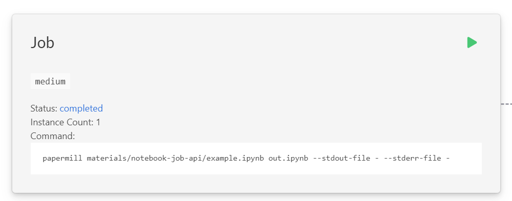

# Example Job API

This notebook is an example of one you might want to run as an API. We will deploy it as a Saturn Cloud Job which has an HTTP endpoint to trigger it running. While Saturn Cloud jobs are normally run either on a schedule or by pressing the start button, they do have the ability to also be triggered by a HTTP request as an API.

The only thing the notebook does in this example is writes a line to the logs (you probably want to make it do more interesting things in practice).

## Set up the job

In Saturn Cloud, create a new **Job resource** that has the following **run command**:

```bash
papermill materials/notebook_job_api/example.ipynb out.ipynb --stdout-file - --stderr-file - --kernel python3
```

You will also need to add `papermill` as a dependency in the pip section. This command uses the papermill package to
execute a notebook and record the output. If you don't want the extra dependency you can use jupyter, which is already on our instances, with the following command:

```bash
jupyter nbconvert --to python --execute materials/notebook_job_api/example.ipynb
```

However when you use jupyter the cell execution isn't capture by the Saturn Cloud logs.

Then, in the **git repositories** of the resource, use this materials resource as a connected repository (`git@github.com:saturncloud/materials.git`). In practice, you'd want to use your own git repo with your particular notebook. You can select a particular branch of the repo if you so choose as well.

This will set up the job that when triggered runs the notebook. The job, unless otherwise specified, will use the latest version of the code in the repo when executing the job.

## Execute the job

If you want to manually run the job, you can press the green start button in the resource:



To run it programmatically, you need a few things:

* **Your saturn instance string** - each Saturn Cloud enterprise account has a unique name that's needed for the API requests. When you log into Saturn Cloud you can get it from the url: `https://app.{saturn_instance}.saturnenterprise.io`.
* **User token** - this is needed to authenticate the request. Get your user token for Saturn Cloud using `https://app.{saturn_instance}.saturnenterprise.io/api/user/token` where again the Saturn Cloud instance is specific to your company. The token is the hexadecimal value in quotes.
* **Resource ID** - the ID of the job can be found in the URL on the resource page for the job. The URL will be something like `https://app.{saturn_instance}.saturnenterprise.io/dash/resources/job/{job_id}` where the job ID is a long hexadecimal value.

With those, you can kick off the job using a HTTP POST request with an empty body. In Python it would be done using the following parameters:

```python
import requests

saturn_instance = "yoursaturninstance"
user_token = "youusertoken" # (don't save this directly in a file!)
job_id = "yourjobid"

url = f'https://app.{saturn_instance}.saturnenterprise.io/api/jobs/{job_id}/start'
headers={"Authorization": f"token {user_token}"}
r = requests.post(url, headers=headers)
```

You can see the logs from the previous execution by clicking the **Status** link on the job page.
